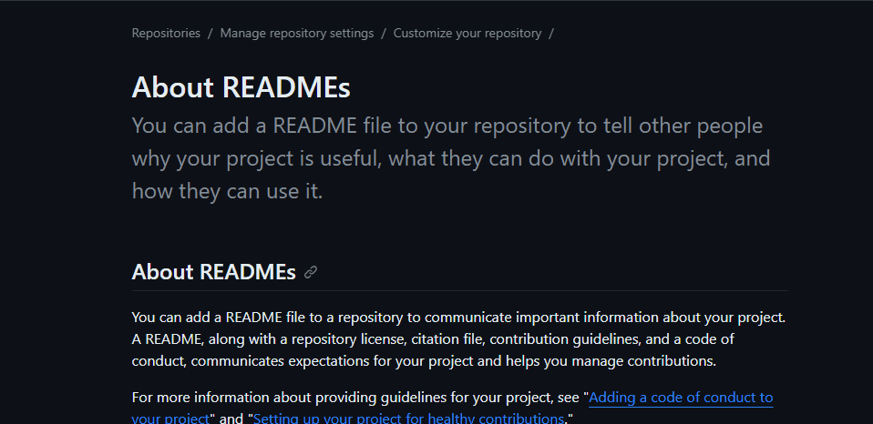

# Projeto com README
Um projeto de teste com um arquivo README 🚀

[](https://github.com/marcelo-luiz-dev)

## Tecnologias utilizadas
- HTML
- CSS
- JS

## Como utilizar
1 - Clone o projeto
```
git clone <https://github.com/marcelo-luiz-dev/repositorio-com-readme.git>
```
2 - Acesse a pasta do projeto
```
cd repositorio-com-readme
```